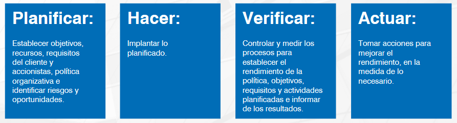
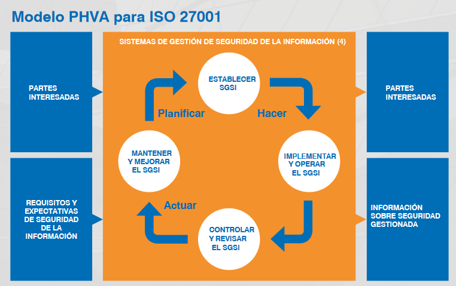

La ISO 27001 se basa en el ciclo PHVA, también conocido como ciclo de Deming. El ciclo PHVA puede aplicarse no solo al sistema de gestión. sino también a cada elemento individual para proporcionar un enfoque en la mejora continua.

    

PHVA es un ejemplo de un sistema cerrado en círculo. Esto asegura el aprendizaje de las fases de hacer y verificar y su uso en las fases de planificación y actuación. En teoría hablamos de un proceso cíclico.

    

